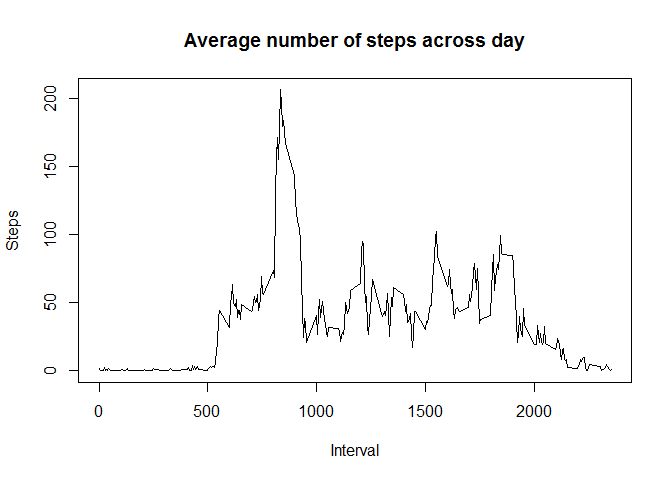
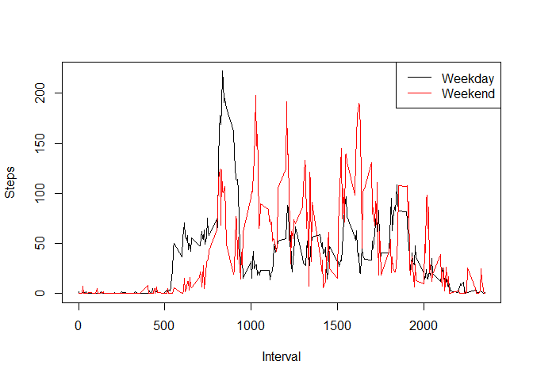

# Reproducible Research: Peer Assessment 1


## Loading and preprocessing the data


```r
if(!file.exists('activity.csv')){
    unzip('activity.zip')
}
activity <- read.csv('activity.csv')
```

## What is mean total number of steps taken per day?
###(excluding NA days)

###1. Total number of steps taken each day

```r
totSteps <- aggregate(steps~date, sum, data=activity)
```
###2. Histogram of the total number of steps taken each day 

```r
hist(totSteps$steps,breaks =  11, freq = FALSE, main = "Total steps each day", xlab = "Total steps")
```

 

###3. Mean and median total number of steps taken per day

```r
mean(totSteps$steps)
```

```
## [1] 10766.19
```

```r
median(totSteps$steps)
```

```
## [1] 10765
```
## What is the average daily activity pattern?
###1. Time series plot of the 5-minute interval (x-axis) and the average number of steps taken, averaged across all days (y-axis)

```r
averSteps <- aggregate(steps~interval, mean, data=activity)
plot(averSteps$interval, averSteps$steps, type = "l", main = "Average number of steps across day", xlab = "Interval", ylab = "Steps")
```

 

###2. 5-minute interval, which on average across all the days in the dataset, contains the maximum number of steps

```r
averSteps[which.max(averSteps$steps),]
```

```
##     interval    steps
## 104      835 206.1698
```

## Imputing missing values
###1. Total number of missing values in the dataset

```r
sum(is.na(activity$steps))
```

```
## [1] 2304
```
###2. Strategy for filling in all of the missing values in the dataset
###Let's use average number of steps for period to fill missing values.
###See the code below...

###3. New dataset that is equal to the original dataset but with the missing data filled in

```r
adjActivity <- activity
for(i in 1:dim(activity)[1])
{if (is.na(activity[i,]$steps)) {adjActivity[i,]$steps <-averSteps$steps[which(averSteps$interval == activity[i,]$interval)] } }
```

###4. Histogram of the total number of steps taken each day

```r
adjTotSteps <- aggregate(steps~date, sum, data=adjActivity)
hist(adjTotSteps$steps,breaks =  11, freq = FALSE, main = "Adjusted total steps each day", xlab = "Total steps")
```

 

### Mean and median total number of steps taken each day

```r
mean(adjTotSteps$steps)
```

```
## [1] 10766.19
```

```r
median(adjTotSteps$steps)
```

```
## [1] 10766.19
```
###There were no significant changes in mean and median values because of the appropriate strategy for filling in the missing values in the dataset

## Are there differences in activity patterns between weekdays and weekends?
###1. Factor variable with two levels - "weekday" and "weekend" indicating whether a given date is a weekday or weekend day

```r
activity$day <- weekdays(as.POSIXlt(activity$date, format="%Y-%m-%d"))
wdlvl <- as.factor(sapply(activity$day, function(x) {ifelse(x %in% c("Suturday","Sunday"),"weekend","weekday") }))
```
###2. Time series plot of the 5-minute interval (x-axis) and the average number of steps taken, averaged across all weekday days or weekend days (y-axis)

```r
averStepswd <- aggregate(steps~interval+wdlvl, mean, data=activity)
averStepswd$wdlvl <- as.factor(averStepswd$wdlvl)
library(reshape2)
averStepswd <- dcast(averStepswd, interval~wdlvl)
```

```
## Using steps as value column: use value.var to override.
```

```r
plot(averStepswd$interval, averStepswd$weekday, type="l", xlab="Interval", ylab="Steps")
#plot second line
lines(averStepswd$interval, averStepswd$weekend, type="l", col = "red")
#legends
legend("topright", c("Weekday", "Weekend"), lwd=1, col=c("black", "red"))
```

 


